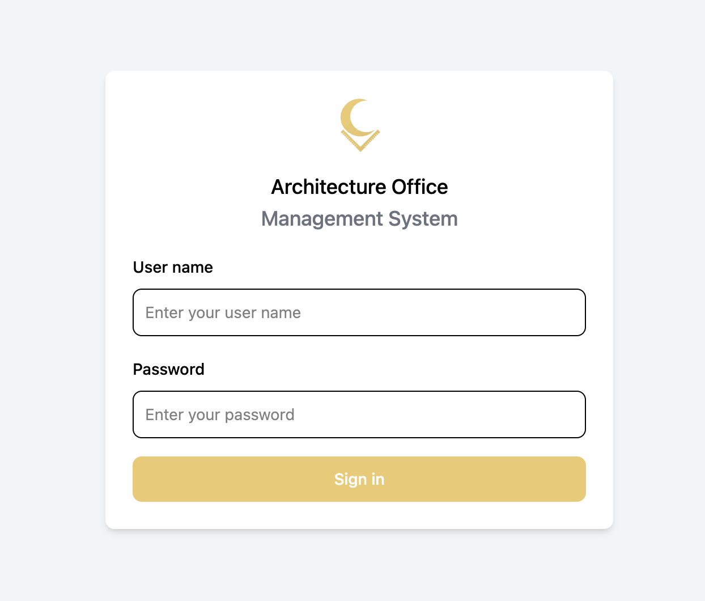
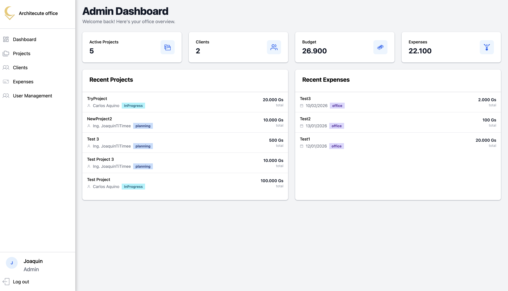
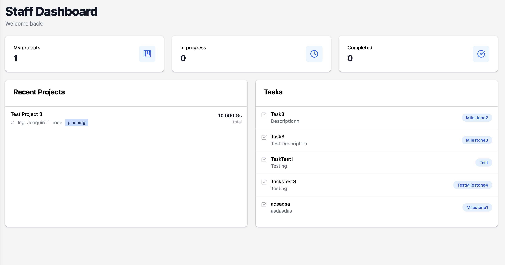
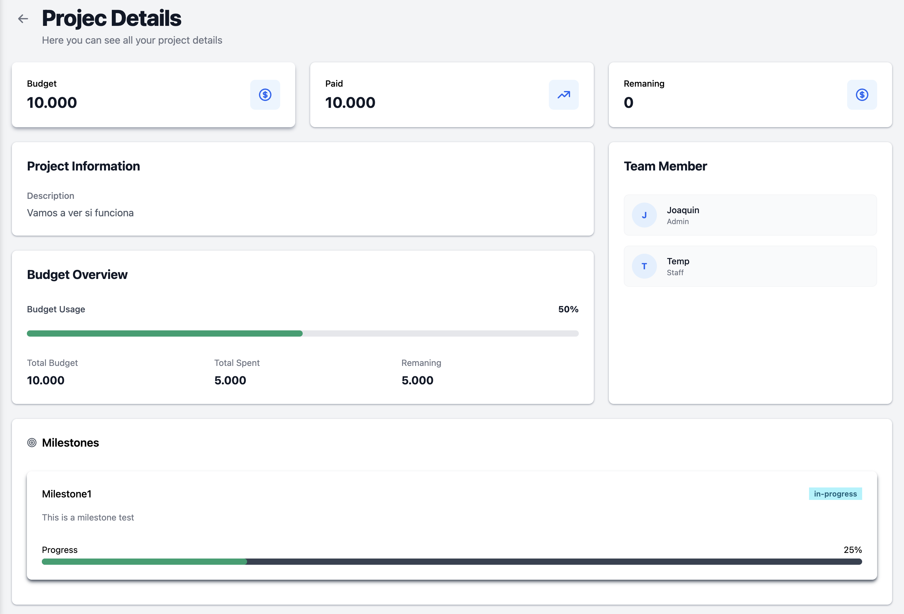
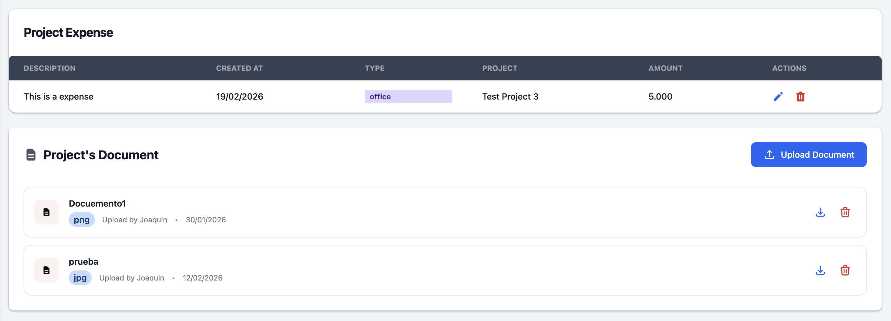

# 🏗️ Architecture Office Management System

## Overview

The Architecture Office Management System is a full-stack web application designed to streamline the daily operations of an architecture and construction office.

It allows teams to manage projects, track expenses, organize client information, and control user access through role-based permissions.

## Features

- 🔐 JWT-based authentication and authorization
- 👥 Role-based access control (Admin, Staff)
- 📁 Project management (create, update, delete, assign users)
- 🧾 Client management
- 💰 Office expense tracking
- 📊 Project-related expense tracking
- 📎 Document upload and management

## Technologies Used

### 🎨 Frontend

- React – Single Page Application (SPA)

- React Router – Client-side routing

- Axios – HTTP requests to backend API

- Tailwind CSS + Flowbite React – UI components and styling

### ⚙️ Backend

- NestJS – Scalable Node.js framework

- TypeScript – Strongly typed JavaScript

- TypeORM – ORM for database interaction

- Class Validator & DTOs – Input validation and data integrity

- JWT (JSON Web Token) – Authentication and authorization

### 🗄️ Database

- PostgreSQL – Relational database

## Screenshots

### Login



### Dashboard

#### Admin



#### Staff



### Project Details





### 🔐 Authentication & Security

- JWT-based authentication

- Role-based access control (RBAC)

- Guards & middleware (NestJS)

### 🧪 Development & Tools

- Git & GitHub – Version control

- Postman / Thunder Client – API testing

## Architecture

The system follows a **client-server architecture**:

- **Frontend:** React SPA communicating via REST API
- **Backend:** NestJS REST API with modular structure
- **Database:** PostgreSQL managed through TypeORM
- **Authentication:** JWT tokens with role validation

## Project Structure

```txt
/
├── backend/        # NestJS backend (API, services, database access)
├── frontend/       # React frontend (pages, components, UI)
├── docs/           # Database diagram, screenshots
│   ├── database-diagram.png
│   └── screenshots/
└── README.md
```

## Author

**Joaquin Aquino**

- Computer Engineering Student
- Pamukkale University
